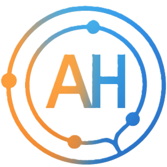

<p align="center">
  
</p>

# Andy Heggs Portfolio

This is the source code for my personal developer portfolio website, built with React and Vite. The site showcases my projects, technical skills, and insights, and provides an interactive, visually engaging experience for visitors and collaborators.

## Table of Contents
- [Features](#features)
- [Sections & Components](#sections--components)
- [Tech Stack](#tech-stack)
- [Getting Started](#getting-started)
- [Project Structure](#project-structure)
- [Available Scripts](#available-scripts)
- [License](#license)

## Features
- Modern, responsive two-column layout (sidebar + main content)
- Modular React component architecture
- Custom CSS for all sections, with desktop and mobile breakpoints
- Animated technical skills orbit and filterable skills categories
- Project and insight archives with dynamic data
- Smooth scrolling navigation and sticky sidebar
- Social media integration (LinkedIn, GitHub)
- Contact form with Web3Forms integration and notifications
- Data visualizations (Nivo, D3) ready for portfolio projects
- Routing for insights and project archives (React Router)

## Sections & Components
- **Hero:** Name, title, and tagline with gradient text
- **Navbar:** Smooth-scroll navigation, mobile sidebar menu
- **Socials:** LinkedIn and GitHub icons with hover effects
- **About:** Career summary, technical focus, and links to connect or download CV
- **MyWork:** Latest 3 projects with images, tech badges, and show more button
- **Skills:** Animated orbit of skills by category (desktop) and filterable stack (mobile)
- **Insights:** Recent articles and research, with links to full text
- **Contact:** Contact info and form (email, phone, location, form submission)
- **Archives:** `/projects` and `/insights` routes for full project and article lists

## Tech Stack
- **Framework:** [React](https://react.dev/)
- **Build Tool:** [Vite](https://vitejs.dev/)
- **Styling:** Custom [CSS](https://www.w3.org/Style/CSS/), [Emotion](https://emotion.sh/docs/styled)
- **UI Components:** [Material UI Icons](https://mui.com/material-ui/material-icons/)
- **Data Visualization:** [Nivo](https://nivo.rocks/), [D3 Hierarchy](https://github.com/d3/d3-hierarchy)
- **Animation:** [Framer Motion](https://www.framer.com/motion/)
- **Linting:** [ESLint](https://eslint.org/)
- **Routing:** [React Router DOM](https://reactrouter.com/)

## Getting Started

### Prerequisites
- Node.js (v18 or above recommended)
- npm

### Installation
1. **Clone the repository:**
   ```bash
   git clone https://github.com/andyheggs/portfolio.git
   cd portfolio
   ```
2. **Install dependencies:**
   ```bash
   npm install
   ```
3. **Start the development server:**
   ```bash
   npm run dev
   ```
   The site will be available at `http://localhost:5173` (or as specified by Vite).
4. **Build for production:**
   ```bash
   npm run build
   ```
5. **Preview production build:**
   ```bash
   npm run preview
   ```

## Project Structure
```
.
├── public/           # Static assets (PDFs, images, redirects)
├── src/
│   ├── assets/       # Images, SVGs, and data files
│   ├── Components/   # Modular React components (Hero, Navbar, About, MyWork, Skills, Insights, Contact, Socials)
│   ├── pages/        # Archive pages for projects and insights
│   ├── App.jsx       # Main app entry (routing and layout)
│   ├── main.jsx      # ReactDOM render entry
│   ├── App.css       # App-level and layout styles
│   └── index.css     # Global styles
├── index.html        # HTML template
├── package.json
├── vite.config.js
└── eslint.config.js
```

## Available Scripts
- `npm run dev` – Start the local development server
- `npm run build` – Build the application for production
- `npm run preview` – Preview the production build locally
- `npm run lint` – Run ESLint to check for code issues

## License
This project is private and not licensed for redistribution.

---
*Made with ❤️ by Andy Heggs*
